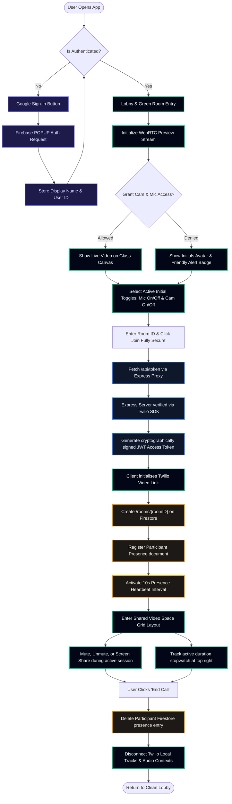

# Twilio & Firebase Secure Video Sync Flowchart

This document outlines the end-to-end user lifecycle, networking, authentication, token provisioning, and active state management of our video platform.

---

## ─── VISUAL STATE MACHINE Flowchart ───



---

## ─── SYSTEM LIFECYCLE SCHEMATIC (ASCII Architecture) ───

```text
┌─────────────────────────────────────────────────────────────────────────────────────────┐
│                                   CLIENT WEB BROWSER                                    │
│                                                                                         │
│  LOBBY SCREEN (Pre-Join / "Green Room")                                                 │
│  ┌────────────────────────────────────────────────────────┐                             │
│  │ 1. Firebase Auth Popup -> Authenticates user           │                             │
│  │ 2. WebRTC Preview Stream -> Pre-authenticates Cam/Mic  │                             │
│  │ 3. UI Toggles -> Initial Mic State  [On/Off]           │                             │
│  │                  Initial Cam State  [On/Off]           │                             │
│  └───────────────────────────┬────────────────────────────┘                             │
│                              │                                                          │
│                              │ (Rooms join requested)                                   │
│                              ▼                                                          │
│  JWT SIGNING TRANSACTION                                                                │
│  ┌────────────────────────────────────────────────────────┐                             │
│  │ 4. HTTP POST /api/token {identity, roomName}           ├──────────┐                  │
│  │                                                        │          │                  │
│  │ 5. Returns Signed JWT Token                           │◄─────────┼──────────┐       │
│  └───────────────────────────┬────────────────────────────┘          │          │       │
│                              │                                       │          │       │
│                              │ (Join Twilio Channel)                 │          │       │
│                              ▼                                       │          │       │
│  ACTIVE ROOM SPACE                                                   │          │       │
│  ┌────────────────────────────────────────────────────────┐          │          │       │
│  │ 6. Initialises SFU Peer Stream matching selection      │          │          │       │
│  │ 7. Periodically calls database heartbeat (10s)         │          │          │       │
│  │ 8. Manages live Stopwatch UI State & UI Stream updates │          │          │       │
│  └───────────────────────────┬────────────────────────────┘          │          │       │
│                              │                                       │          │       │
│                              │ (Clean-up on Leave)                   │          │       │
│                              ▼                                       │          │       │
│ ┌──────────────────────────────────────────────────────────┐         │          │       │
│ │ 9. Delete Presence Entry, Stop Local WebRTC Tracks       │         │          │       │
│ └──────────────────────────────────────────────────────────┘         │          │       │
└──────────────────────────────────────────────────────────────────────┼──────────┼───────┘
                                                                       │          │
                                                                       │          │
┌──────────────────────────────────────────────────────────────────────▼──────────┼───────┐
│                               DEVELOPMENT BACKEND SECURE HOST                   │       │
│                                                                                 │       │
│  EXPRESS APP API SERVERS                                                        │       │
│  ┌──────────────────────────────────────────────────────────────────────────────┴────┐  │
│  │ /api/token                                                                         │  │
│  │  - Receives Auth Verification Credentials                                          │  │
│  │  - Checks Sandbox Constraints                                                      │  │
│  │  - Signs JWT payload using Twilio SECRET parameters safely on backend host         │  │
│  └────────────────────────────────────────────────────────────────────────────────────┘  │
└─────────────────────────────────────────────────────────────────────────────────────────┘
                                                                                  ▲
                                                                                  │
┌─────────────────────────────────────────────────────────────────────────────────┼───────┐
│                               PERSISTENT INFRASTRUCTURE SERVICES                │       │
│                                                                                 │       │
│  FIREBASE FIRESTORE                                                                     │
│  ┌──────────────────────────────────────────────────────────────────────────────┘       │
│  │ Path: /rooms/{roomID}/participants/{identity}                                         │
│  │  - Synchronizes dynamic presence directories across remote team networks              │
│  │  - Clean schema defined by firebase-blueprint.json                                   │
│  │  - Secured safely by strict rules defined in firestore.rules                         │
│  └──────────────────────────────────────────────────────────────────────────────────────┘
└─────────────────────────────────────────────────────────────────────────────────────────┘
```

---

## ─── RUNNING THE FLOW ───

1. **Gatekeeping via Google Provider**: Security check on client mount redirects unauthenticated views to authentication action (`signInWithGoogle`).
2. **WebRTC Access & "Green Room" Preview**: Eliminates sudden hardware shocks. Users can evaluate how their background looks without going to browser settings after joining a live session.
3. **Double Verification Heartbeat**: Active participants send automated Firestore update calls every 10 seconds.
4. **Clean Detachment Hook**: Leaving action executes both Twilio server disconnect and Firestore collection pruning synchronously to prevent lingering static profiles.
